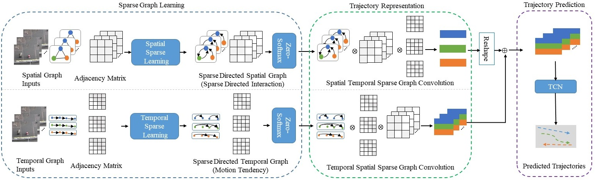
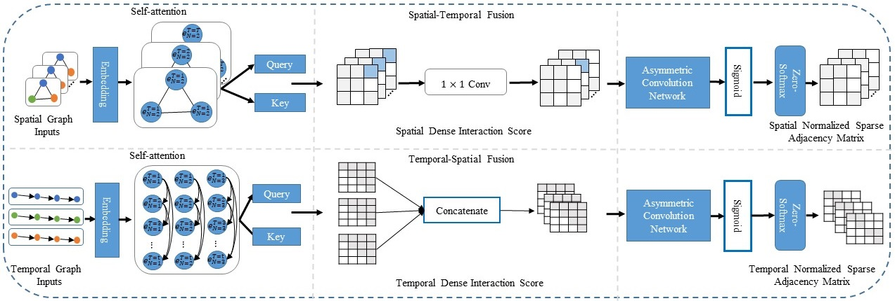

# SGCN
Code for SGCN:Sparse Graph Convolution Network for Pedestrian Trajectory Prediction (CVPR2021)

[Paper](https://arxiv.org/pdf/2104.01528.pdf)

## Environment

The code is trained and tested on RTX 2080Ti, Python 3.6.2, numpy 1.19.0, pytorch 1.2.0 and CUDA11.2.

## SGCN


SGCN models the sparse graph in two views:

1) a Spatial Sparse Graph to represent sparse interaction
2) a Temprial Sparse Graph to represent diverse motion tendencies

### framework


### Sprarse Graph Learning




## Train

To train a model on a single dataset, such as eth, you can run below code in root directory of this project:

```
python train.py --dataset eth

```
or training on each dataset:

```
sh train.sh

```

## Test

To evaluate your trained model or our pretrain model you can run:

```
test.py

``` 

Note that the pretrain models lie in 'checkpoints'.


## Download

You can download this project by :

```
git clone https://github.com/shuaishiliu/SGCN.git
```

## Cite

If you find this repo useful, please consider citing our paper
```bibtex
@inproceedings{shi2021sgcn,
  title={Sparse Graph Convolution Network for Pedestrian Trajectory Prediction},
  author={Liushuai Shi and Le Wang and Chengjiang Long and Sanping Zhou and Mo Zhou and Zhenxing Niu and Gang Hua},
  booktitle={Proceedings of the IEEE/CVF Conference on Computer Vision and Pattern Recognition},
  year={2021}
}
```


## Reference

The code base borrows from [Social-STGCNN](https://github.com/abduallahmohamed/Social-STGCNN)
